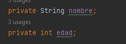
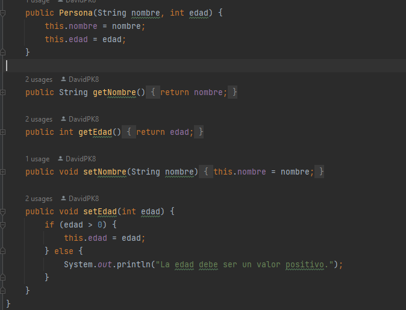
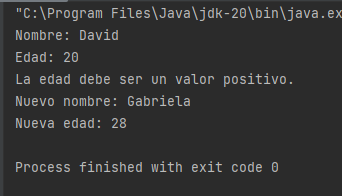
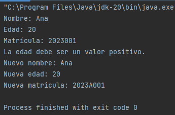
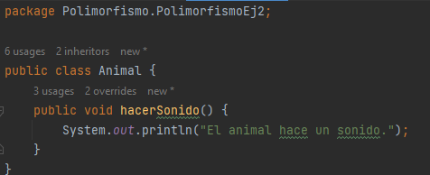
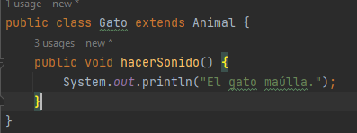
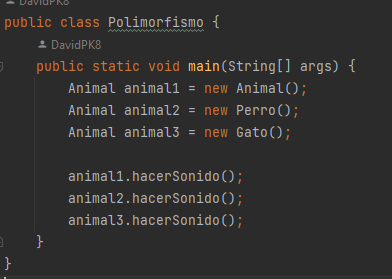

# Pilares-POO
## 1) Abstracción
### Explicación
La abstracción se trata de simplificar la realidad al modelar objetos y conceptos complejos en el software. En lugar de tratar con todos los detalles específicos de un objeto, se destacan solo los aspectos relevantes para la tarea en cuestión. 
### Ejemplos:
#### 1. Ejemplo Abstracción Carros
|  En este ejemplo, se utiliza la abstracción para definir una clase base abstracta llamada Vehicle. Esta clase tiene dos métodos abstractos: start() y stop(), que representan acciones genéricas de encendido y apagado de un vehículo. |  Las clases derivadas Car y Motorcycle heredan de la clase Vehicle y proporcionan implementaciones específicas para los métodos start() y stop() según el tipo de vehículo.| En el método main, se crean instancias de las clases Car y Motorcycle y se llama a los métodos start() y stop() en cada una. La abstracción permite tratar a los vehículos de manera general, sin preocuparse por los detalles específicos de su funcionamiento interno.|
|--------------------------|----|----|

#### 2. Ejemplo Abstracción Geométrica
| En este ejemplo, se utiliza la abstracción a través de una interfaz llamada Shape. Esta interfaz define un único método calculateArea(), que representa la acción genérica de calcular el área de una forma geométrica. | Las clases Circle y Rectangle implementan la interfaz Shape y proporcionan implementaciones específicas para el cálculo del área según la forma.| En el método main, se crean instancias de las clases Circle y Rectangle y se llama al método calculateArea() en cada una. La abstracción permite tratar a las formas geométricas de manera uniforme, sin preocuparse por las diferencias específicas entre círculos y rectángulos.|
|-|-|-|

#### 3. Ejemplo Abstracción Cuenta
| En este ejemplo, se emplea la abstracción para definir una clase base abstracta llamada BankAccount. Esta clase contiene una propiedad balance y métodos abstractos deposit() y withdraw() que representan acciones genéricas para depositar y retirar dinero.| Las clases derivadas CheckingAccount y SavingsAccount heredan de BankAccount y proporcionan implementaciones específicas para los métodos deposit() y withdraw() según el tipo de cuenta.| En el método main, se crean instancias de las clases CheckingAccount y SavingsAccount se realizan depósitos y retiros en cada una, y la abstracción permite gestionar las cuentas bancarias sin preocuparse por los detalles específicos de cómo funcionan internamente.|
|-|-|-|

## 2) Encapsulamiento
### Explicación
La encapsulación consiste en agrupar datos y los métodos (funciones) que operan sobre esos datos en una única entidad llamada "clase". Una clase encapsula la implementación interna de un objeto y proporciona una interfaz pública para interactuar con él. Esto significa que el código externo no necesita conocer los detalles internos de cómo funciona la clase, solo necesita utilizar los métodos públicos proporcionados.
### Ejemplos:

#### 1. Ejemplo Encapsulamiento 1

| Dentro de la clase "Personas" los atributos se encuentran declarados en privados por lo cual no pueden ser llamados por otra clase que no sea la misma. | Una vez creados los atributos se procede a crear los metodos publicos los cuales permitiran que se puedan acceder a los atributos en otra clase. | Dentro de clase main se puede observar que los atributos finalmente pueden ser llamados junto a los metodos publicos|
|-|-|-|

#### 2. Ejemplo Encapsulamiento 2

| | |
|-|-|
 

#### 3. Ejemplo Encapsulamiento 3

| || |
|-|-|-|

## 3) Herencia
### Explicación
 La herencia es una relación especial entre dos clases, la clase ***Padre*** o la ***SuperClase*** y la clase ***Hija*** en donde la clase Hija obtiene la habilidad de utilizar ciertas propiedades y funcionalidades de la clase Padre. La idea es que la clase Hija “hereda” los métodos y atributos de la clase Padre.  
Una de las ventajas que ofrece la Herencia es la reutilización de código en el programa, puesto que permite ahorrar trabajo al realizar un cambio en en el sistema al permitir que un solo algoritmo pueda procesar distintas clases de entidades.
### Ejemplos: 
#### 1. Herencia Única
*La clase Gato hereda los métodos y atributos de la clase Mascota, por lo cual se puede acceder y setear el nombre de la mascota y del dueño.* 
|Diagrama UML|Ingresar Información|Mostrar Información|
|----------------|--------|--------|
||||  

#### 2. Herencia Jerárquica
*La clase Mascota sirve como una superclase para más de una subclase o clase hija (Gato, Perro, Conejo).*
|Diagrama UML|
|-----|
||

|Clases Diagrama UML|Ingresar Información|Mostrar Información|
|-----|--------|--------|
| | ||
||||
| |||
#### 3. Herencia Multinivel
*La **clase "nieta" (Perro)** heredará los métodos y atributos de una **clase padre (Mascota)** y, además, la clase Mascota también heredará los métodos y atributos de una **clase "Abuela" (Animal_Dom)** como la clase Padre de la clase Mascota y abuela de la clase Perro. La **clase Lobo es hija** de la **clase Padre, Animal_Salv**.*
|Diagrama UML|
|-----|
||

|Ingresar Información|Mostrar Información|
|-----|-----|
|||
|||
## 4) Polimorfismo
### Explicación
El polimorfismo permite tratar objetos de diferentes clases de manera uniforme a través de una interfaz común. Puedes crear métodos en una superclase que pueden ser implementados de manera diferente en las subclases. Esto permite que distintos objetos respondan a una misma llamada de método de manera adecuada según su tipo.
### Ejemplos:
#### 1.
Supongamos que tenemos una jerarquía de clases que representan diferentes formas geométricas, como círculos y rectángulos.

Cada forma geométrica debe calcular su área. Para lograr el polimorfismo, podemos crear una interfaz común llamada "Shape" que define el método para calcular el área.

|||
|-|-|

y luego las clases "Circle" y "Rectangle" implementarán esta interfaz y proporcionarán su propia implementación del cálculo del área.

|||
|-|-|

En este ejemplo, tanto el objeto circle como el objeto rectangle pueden ser tratados de manera uniforme a través de la interfaz Shape, lo que permite llamar al método calculateArea() sin preocuparse por las diferencias específicas entre círculos y rectángulos. Esto es el polimorfismo en acción.

#### 2.
|En el segundo ejemplo se crean 4 clases en las cuales se puede observar que de una clase padre llamada "Animal" se desprenden dos clases hijas llamadas "Perro" y "Gato"|
|---|

||||
|----|---|---|

|La ultima clase llamada "Polimorfismo" se puede observar que se llama el metodo "hacersonido" tanto de la clase padre como de las clases hijas| 
|------|
||

Esto demuestra como el polimorfismo permite que un mismo metodo se comporte de manera diferente segun el tipo real del objeto en tiempo de ejecucion
